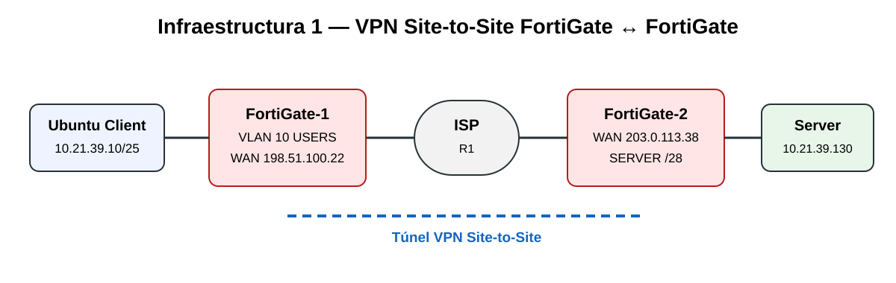
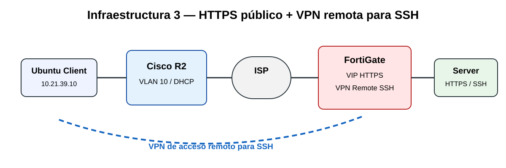

# Práctica 2 — Seguridad de Redes | Infraestructuras VPN

> **Video único de demostración:** [Ver video en YouTube](https://youtu.be/vsI622JK9Ig)

Repositorio de entrega de la **Práctica 2 de Seguridad de Redes**, compuesta por tres infraestructuras implementadas en GNS3 con FortiGate, Cisco, clientes y servidores Ubuntu.

## Objetivo general

Demostrar segmentación de red, VLAN, DHCP, NAT/VIP, políticas de firewall y diferentes modalidades de VPN para proteger la comunicación entre usuarios y servidores.

## Video de la Práctica 2

La demostración final se realizó en **un solo video**, mostrando las tres infraestructuras en este orden:

1. **Infraestructura 1:** FortiGate ↔ FortiGate mediante VPN Site-to-Site.
2. **Infraestructura 2:** FortiGate ↔ Cisco mediante VPN Site-to-Site.
3. **Infraestructura 3:** HTTPS sin VPN y SSH mediante VPN de acceso remoto.

▶️ **Video completo:** [Práctica 2 — Seguridad de Redes | 3 Infraestructuras VPN](https://youtu.be/vsI622JK9Ig)

[Ver guion general del video](docs/video-demostracion.md)

## Infraestructuras

### Infraestructura 1 — FortiGate ↔ FortiGate | VPN Site-to-Site

Objetivo: permitir la comunicación entre el usuario y el servidor únicamente cuando el túnel VPN Site-to-Site esté activo.

[Documentación](docs/infraestructura-1.md) · [Configuración verificada](configs/infraestructura-1/configuracion-verificada.txt)

### Infraestructura 2 — FortiGate ↔ Cisco | VPN Site-to-Site

Objetivo: comunicar la red de usuarios con el servidor remoto mediante una VPN Site-to-Site entre FortiGate y Cisco.

[Documentación](docs/infraestructura-2.md) · [Configuración verificada](configs/infraestructura-2/configuracion-verificada.txt)

### Infraestructura 3 — HTTPS público + SSH por VPN remota

Objetivo: permitir HTTPS al servidor sin VPN y restringir SSH para que sea accesible mediante VPN de acceso remoto.

[Documentación](docs/infraestructura-3.md) · [Configuración](configs/infraestructura-3/configuracion-verificada.txt)

## DPI, Switch, VLAN y seguridad básica

Se incluye documentación específica para DPI/inspección, perfiles de seguridad, logs, switch, VLAN 10 y puertos Access/802.1Q según la implementación real.

[Ver DPI, Switch, VLAN y seguridad básica](docs/dpi-switch-vlan.md)

## Evidencias

Las capturas deben provenir del laboratorio real e incluir, según corresponda:

- topologías
- interfaces
- VLAN 10 / DHCP
- VPN UP
- políticas de firewall
- VIP
- IKE/IPsec en Cisco
- ping
- traceroute
- HTTPS
- SSH
- VPN OFF/ON

[Ver checklist de evidencias](docs/evidencias-finales.md)

## Seguridad

No se publican contraseñas, PSK reales, claves privadas ni valores `psksecret ENC ...`.

## Estado

- Infraestructura 1: validada y documentada.
- Infraestructura 2: validada y documentada.
- Infraestructura 3: documentada para la demostración de HTTPS y acceso remoto SSH.
- Video final: grabado como **un único video de la Práctica 2**.
- Enlace del video: [YouTube](https://youtu.be/vsI622JK9Ig).
