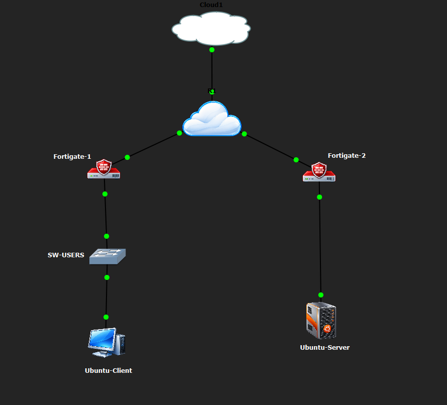

# Práctica 2 — Infraestructura 1 | FortiGate ↔ FortiGate Site-to-Site


## Topología real en GNS3



## Objetivo

Permitir que el usuario de la VLAN 10 se comunique con el servidor remoto mediante un túnel VPN Site-to-Site entre dos FortiGate y demostrar que el tráfico deja de funcionar cuando el túnel se desactiva.

## Direccionamiento verificado

| Elemento | Dirección |
|---|---|
| Usuario | 10.21.39.10/25 |
| VLAN 10 | 10.21.39.0/25 |
| FortiGate-1 WAN | 198.51.100.22/30 |
| ISP hacia FortiGate-1 | 198.51.100.21/30 |
| ISP hacia FortiGate-2 | 203.0.113.37/30 |
| FortiGate-2 WAN | 203.0.113.38/30 |
| Red del servidor | 10.21.39.128/28 |
| Servidor | 10.21.39.130/28 |

## Pruebas principales

```bash
ip addr show ens33
ping -c 4 10.21.39.130
sudo busybox traceroute -n 10.21.39.130
wget --no-check-certificate -T 5 -S -O- https://10.21.39.130/
```

Resultado HTTPS verificado:

```text
HTTP/1.0 200 OK
Servidor HTTPS - Seguridad de Redes
Ubuntu Server 10.21.39.130
```

## Validación

- VPN ON → conectividad y HTTPS funcionan.
- VPN OFF → comunicación falla.
- VPN ON nuevamente → comunicación restaurada.

## Video

Esta infraestructura se muestra dentro del **video único de la Práctica 2**.
