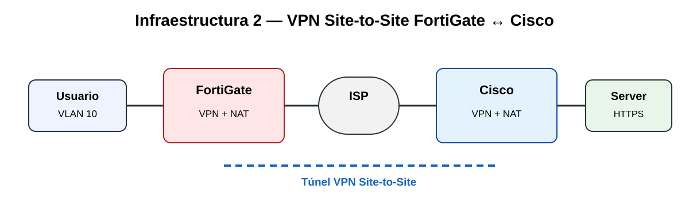

# Infraestructura 2 — FortiGate ↔ Cisco Site-to-Site



## Objetivo

Permitir que el usuario se comunique con el servidor remoto mediante una VPN Site-to-Site entre un FortiGate y un dispositivo Cisco.

## Direccionamiento observado

| Elemento | Dirección |
|---|---|
| FortiGate port1 | 198.51.100.22/30 |
| Gateway ISP | 198.51.100.21 |
| FortiGate port2 | 192.168.57.1/24 |
| VLAN10-USERS | 10.21.39.1/25 |
| Red usuarios | 10.21.39.0/25 |
| Red remota | 10.21.39.128/28 |
| Servidor | 10.21.39.130 |
| Extremo remoto del túnel | 203.0.113.38 |

Ruta observada en FortiGate:

```text
S 10.21.39.128/28 via VPN-FGT1-CISCO tunnel 203.0.113.38
```

## FortiGate

Mostrar en GUI: Interfaces, VLAN10-USERS/DHCP, VPN-FGT1-CISCO en estado UP y Firewall Policy.

## Cisco

```text
show ip interface brief
show crypto isakmp sa
show crypto ipsec sa
```

## Pruebas verificadas

### Traceroute

```bash
sudo busybox traceroute -n 10.21.39.130
```

Se observó:

```text
1  10.21.39.1
2  * * *
3  10.21.39.130
```

El salto intermedio no respondió al traceroute, pero el destino final sí fue alcanzado.

### HTTPS

```bash
wget --no-check-certificate -T 5 -S -O- https://10.21.39.130/
```

Resultado validado: `HTTP/1.0 200 OK`.

## Validación principal

1. VPN activa: ping/HTTPS funcionan.
2. Desactivar temporalmente VPN-FGT1-CISCO.
3. Ping al servidor debe fallar.
4. Reactivar VPN.
5. Ping debe volver a responder.

## Archivos relacionados

- [Configuración verificada](../configs/infraestructura-2/configuracion-verificada.txt)
- [Guía corta de video](video-infraestructura-2.md)
- [DPI, Switch y VLAN](dpi-switch-vlan.md)

## Evidencias gráficas a subir

- topología real
- VLAN 10 / DHCP
- VPN UP
- políticas
- show crypto isakmp sa
- show crypto ipsec sa
- ping
- HTTPS 200 OK
- VPN OFF/ON